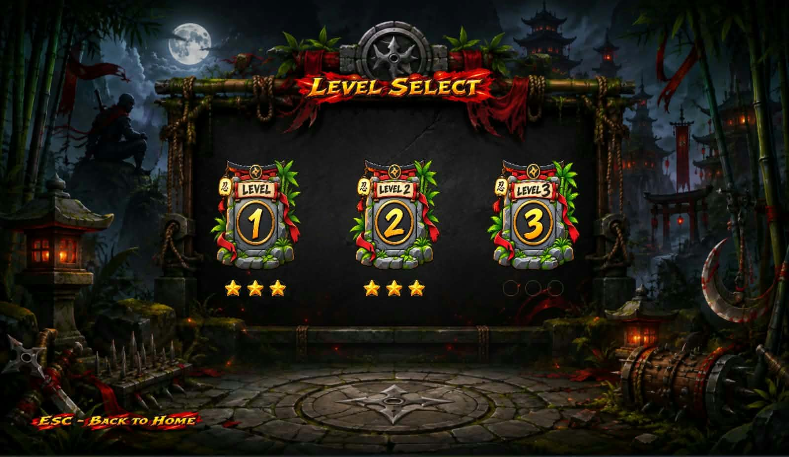
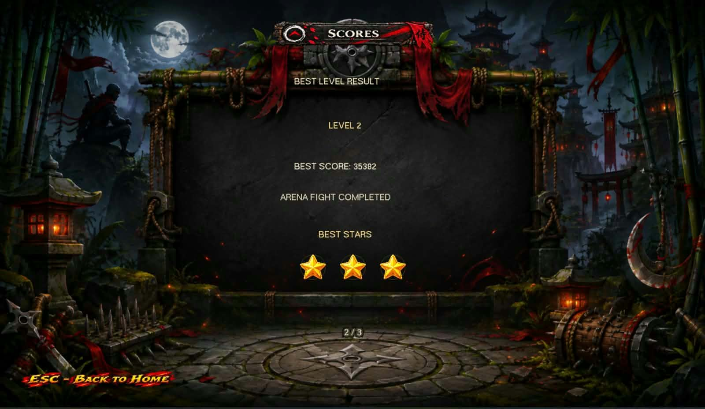
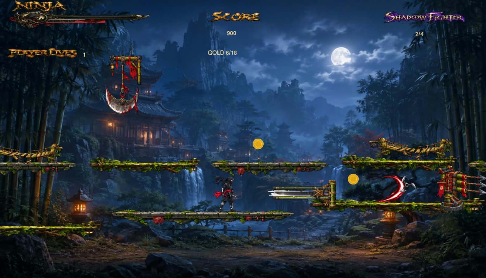
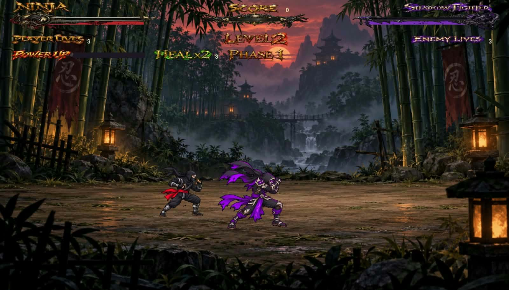
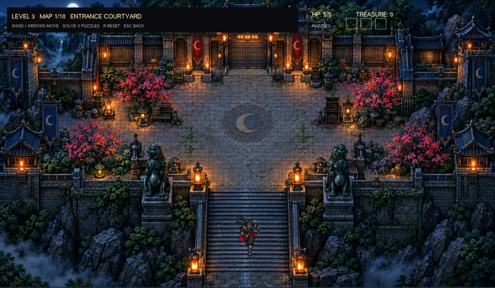
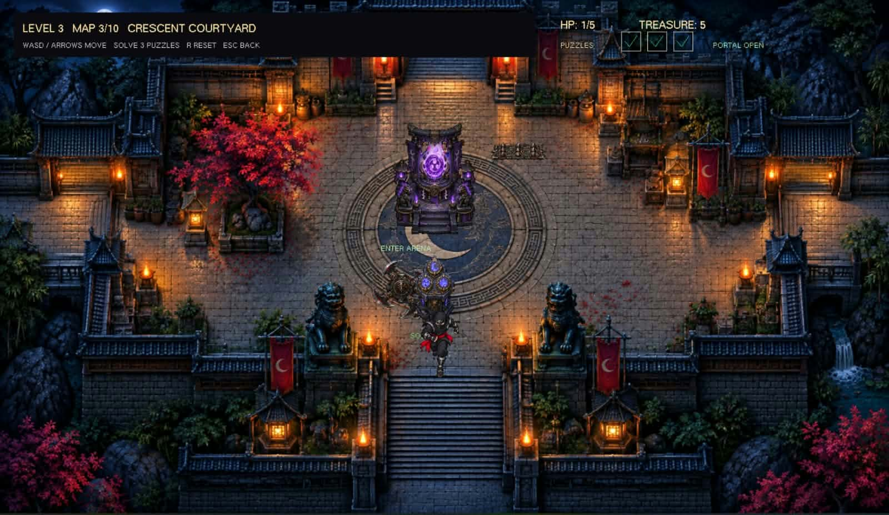
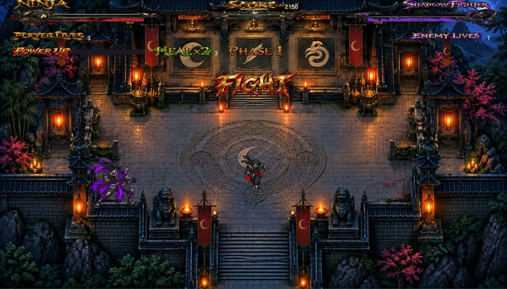

# Ninja Shadow Fight: Where Shadows Collide

A three-level 2D action game built in C++ with iGraphics for Windows. Each level has a different style of play: side-scrolling platforming, a three-phase arena duel, and top-down exploration followed by wave combat. Scores and stars are saved so players can continue unlocking levels.

**Course:** CSE 1200 — Software Development I  
**Department:** Computer Science and Engineering, Ahsanullah University of Science and Technology (AUST)  
**Repository:** [Ninja Shadow Fight](https://github.com/maariaaislam/Ninja_Shadow_Fight)

## Features

- Three levels with distinct movement, enemies, and objectives.
- Home, Level Selection, Settings, and Scoreboard screens.
- Remappable controls, audio settings, and saved progress.
- Score and star ratings; earning at least one star unlocks the next level.
- Animated combat, hazards, shuriken, health, and result screens.

## Levels

| Level | Gameplay | Goal |
| --- | --- | --- |
| **1 — Platformer** | Cross a scrolling world, avoid traps, collect gold, and fight Shadow enemies. | Reach the exit. |
| **2 — Arena Duel** | Fight a villain through three increasingly difficult phases using attacks, block, shuriken, power, and limited healing. | Defeat Phase 3. |
| **3 — Exploration and Arena** | Explore ten connected areas, solve three puzzles, and enter the portal for three combat waves. | Clear the final wave. |

## Requirements

- Windows PC.
- A C++ compiler and the project's compatible **iGraphics/GLUT, OpenGL, GLU, and Win32 multimedia** dependencies.
- Game images and other assets in their original project folders.
- VS Code with the Microsoft C/C++ extension if building from VS Code.

> The original `.sln`/`.vcxproj` targets Visual Studio 2013 **Win32**. VS Code can edit and launch the project, but it needs a separate compiler and libraries. The solution file itself is not a G++ build command. Match the architecture and library format to the compiler you use.

## Build and Run in VS Code

1. Open the folder containing `Ninja_Fight.sln` in VS Code and trust the workspace.
2. Keep `Ninja_Fight/iMain.cpp`, its headers, iGraphics files, and asset folders together in their original layout.
3. Install a **32-bit MinGW G++** toolchain and compatible 32-bit iGraphics/GLUT libraries. In the VS Code terminal, check `g++ --version`.
4. Place the project's MinGW `.vscode/tasks.json` in the folder containing `Ninja_Fight.sln`.
5. Choose **Terminal → Run Task → Run Ninja Fight (MinGW)**. The task compiles `iMain.cpp` and starts the game.

The game must start with its working directory set to the inner `Ninja_Fight` project folder so relative image, settings, and progress paths resolve. If the build reports a missing header or library, update the include/library paths in `tasks.json` to match the installed iGraphics package. The task requires MinGW-compatible library files; a Visual Studio-only `.lib` may not work with G++.

## Controls

Controls can be changed on the **Settings** screen. The actions available depend on the current level.

| Action | Level 1 | Level 2 | Level 3 |
| --- | --- | --- | --- |
| Move | Left/right; sprint and crouch | Left/right; jump | Four directions |
| Attack | Four shuriken choices (`1`–`4`) | Punch, kick, heavy strike, shuriken | Directional melee and shuriken |
| Defense and abilities | Dash | Block, dash, power, heal | Block, dash, power, heal in the arena |
| Menus | `Esc` returns to Level Selection | `Esc` returns to Level Selection | `Esc` returns to Level Selection |

For the current key bindings, use **Settings → Controls** in the game. Mouse buttons can also trigger attacks in the combat levels.

## Screenshots

The screenshots below are taken from the project report.

### Level Selection and Scoreboard

*Select an unlocked level and review its stars.*

*The scoreboard keeps the best result.*

### Level 1: Platformer

*Cross platforms, collect gold, and avoid hazards.*

### Level 2: Arena Duel

*The hero faces the villain in a three-phase fight.*

### Level 3: Exploration and Arena

*Explore connected maps and solve puzzles.*

*The portal opens after all three seals are solved.*

*Clear three escalating enemy waves.*

## Project Structure

| File or folder | Responsibility |
| --- | --- |
| `Ninja_Fight.sln`, `Ninja_Fight/Ninja_Fight.vcxproj` | Original Windows project configuration. |
| `Ninja_Fight/iMain.cpp` | Startup, game-state transitions, input callbacks, update loop, and result handoff. |
| `Ninja_Fight/Screens.h`, `Ninja_Fight/New.h` | Loading/Home screens and Level Selection. |
| `Ninja_Fight/Gameplay.h`, `Ninja_Fight/Level1.h` | Shared ninja movement, camera, shuriken, and Level 1. |
| `Ninja_Fight/Level2.h`, `Ninja_Fight/Level3.h` | Arena duel, exploration, puzzles, and wave combat. |
| `Ninja_Fight/Settings.h`, `Ninja_Fight/Scoreboard.h` | Controls/audio settings and saved scores/progression. |
| `Ninja_Fight/Music.h` | Music and volume handling. |
| Image and audio folders | Assets loaded by the game; preserve their relative paths. |

The update timer runs about every **30 ms**. `iMain.cpp` updates and draws only the active menu or level. On completion, the level submits its result to the scoreboard, which saves improved records and refreshes unlocked levels and stars.

## Save Files

- `game_settings.txt` — audio settings and remapped controls.
- `level_progress.txt` — best scores, stars, gold, and unlocked levels.

These files are created or updated relative to the game's working directory. Keep them if you want to preserve progress.

## Team

| Member | Student ID |
| --- | --- |
| Shanzida Sultana | 00725105101071 |
| Maria Islam | 00725105101086 |
| Siam Hossain Rafi | 00725105101087 |

The team developed and integrated the game's interface, level mechanics, assets, progression, and documentation. Individual work can be reviewed through the repository's commit history.

## Known Limitations and Future Work

- Audible music requires valid audio tracks and paths configured in `Music.h`.
- Developer shortcuts for map jumps and level selection should be disabled for a release build.
- Further playtesting and checks for map exits, collisions, and difficulty would improve the game.

## License

No license is specified in the supplied project material. Contact the project team before reusing its code or assets.
