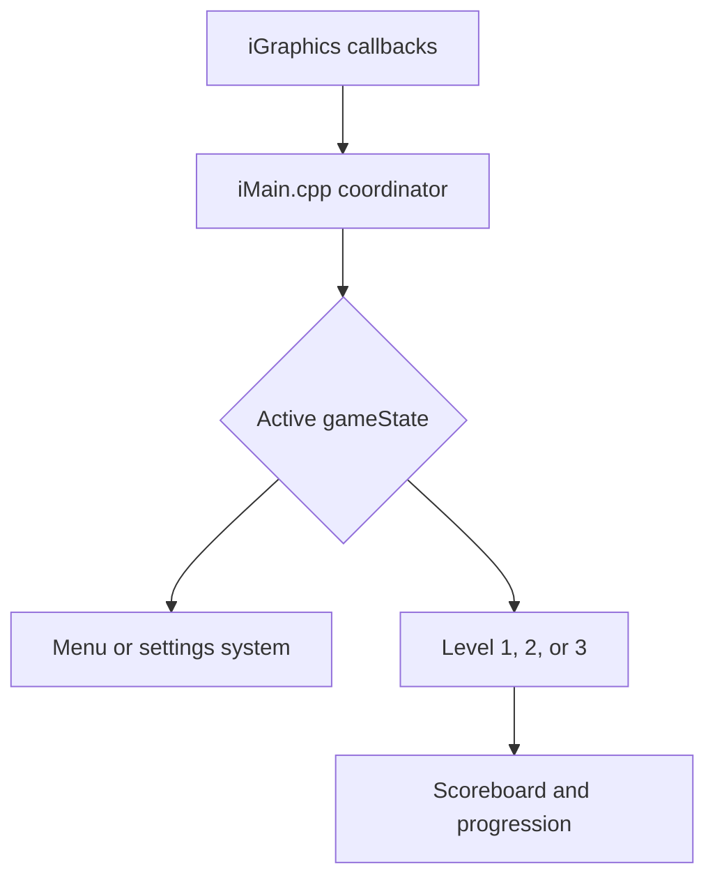
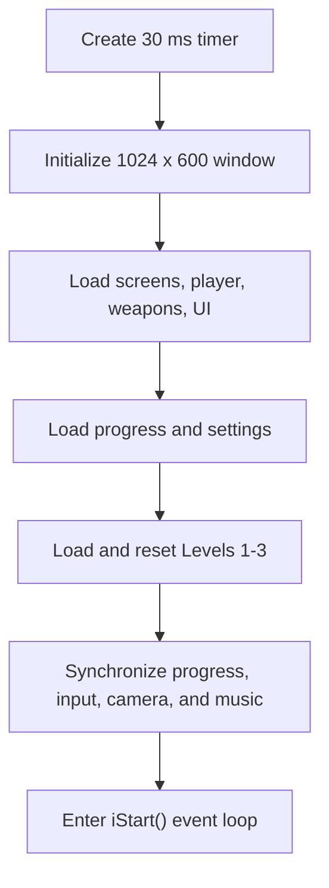

# Ninja Fight

**Ninja Fight** is a multi-level 2D action game developed in C++ with the iGraphics framework, GLUT/OpenGL rendering, and Win32 multimedia support. The project combines platform movement, arena combat, top-down exploration, enemy artificial intelligence, progression tracking, configurable controls, and persistent scoring in a single event-driven game architecture.

The game contains three mechanically distinct levels:

- **Level 1:** Side-scrolling platform action with traps, collectibles, enemies, shuriken combat, and camera tracking.
- **Level 2:** One-on-one arena fighting with jump physics, timed attacks, projectiles, power mode, healing, and three escalating phases.
- **Level 3:** Ten-map top-down exploration with puzzles and hazards, followed by a four-direction arena battle with three enemy waves.

---

## Table of Contents

- [Project Overview](#project-overview)
- [Core Features](#core-features)
- [Technology Stack](#technology-stack)
- [System Architecture](#system-architecture)
- [Runtime Flow](#runtime-flow)
- [Gameplay](#gameplay)
- [Movement and Collision](#movement-and-collision)
- [Controls](#controls)
- [Project Structure](#project-structure)
- [Build and Run](#build-and-run)
- [Configuration and Save Data](#configuration-and-save-data)
- [Game Assets](#game-assets)
- [Development Notes](#development-notes)
- [Extending the Project](#extending-the-project)
- [License and Distribution](#license-and-distribution)

---

## Project Overview

Ninja Fight is organized around a central state coordinator in `iMain.cpp`. The iGraphics callback system supplies drawing, timer, mouse, and keyboard events. `iMain.cpp` routes each event to the currently active screen or level while the individual header modules own their own gameplay rules.

The game runs at a fixed update interval of approximately **30 milliseconds** and uses a **1024 x 600** window. Only the active game state is updated and rendered, preventing inactive menus or levels from continuing their simulation in the background.

### Main game states

| State | Purpose |
|---|---|
| `STATE_LOADING` | Displays the loading screen and advances the loading timer. |
| `STATE_HOME` | Presents the main menu. |
| `STATE_LEVEL_SELECT` | Displays level cards, unlock status, and earned stars. |
| `STATE_LEVEL1` | Runs the side-scrolling platform level. |
| `STATE_LEVEL2` | Runs the three-phase fighting arena. |
| `STATE_LEVEL3` | Runs top-down exploration and the final wave arena. |
| `STATE_SCOREBOARD` | Displays saved scores and level progress. |
| `STATE_SETTINGS` | Manages volume, sound, and control remapping. |

---

## Core Features

- Three levels with different movement and combat models
- Event-driven update, input, and rendering pipeline
- Player animation state machines
- Ground and air movement with acceleration, friction, gravity, and dashing
- Top-down movement with diagonal-speed normalization
- Platform, rectangle, hitbox, and foot-point collision systems
- Melee attacks synchronized with animation impact frames
- Multiple shuriken and projectile types
- Enemy chasing, blocking, dodging, jumping, and ranged attacks
- Multi-phase and multi-wave difficulty progression
- Health, lives, healing charges, power meter, combo, and score systems
- Collectibles, traps, puzzles, portals, and directional map exits
- Persistent level progress, high scores, stars, and settings
- Remappable keyboard controls
- Mouse-supported combat actions
- Context-sensitive music-routing system

---

## Technology Stack

| Technology | Role |
|---|---|
| C/C++ | Core game implementation |
| iGraphics | Window, image, text, timer, mouse, and keyboard callbacks |
| GLUT | Window and input integration used by iGraphics |
| OpenGL | 2D rendering and sprite mirroring |
| Win32 Multimedia / MCI | Music loading, looping, stopping, and volume control |
| Visual Studio | Solution and Win32 project build environment |
| `stb_image` | Image loading support |

The supplied Visual Studio project targets **Win32** and uses the legacy **v120** platform toolset. Newer Visual Studio installations can retarget the project when v120 is unavailable.

---

## System Architecture



### Responsibility-first design

| File | Primary responsibility |
|---|---|
| `iMain.cpp` | Startup, global objects, state transitions, callback routing, input normalization, result submission, and music synchronization |
| `Gameplay.h` | Shared player state, Level 1 physics, hitboxes, camera, and shuriken behavior |
| `Level1.h` | Side-scrolling world data, platforms, traps, gold, enemies, score, and completion logic |
| `Level2.h` | Hero and villain fighters, combat timing, AI, projectiles, effects, phases, scoring, and results |
| `Level3.h` | Ten-map exploration, walk/block regions, exits, traps, puzzles, portal activation, arena waves, and top-down combat |
| `Scoreboard.h` | Saved completion state, best score, stars, collectibles, and level unlocking |
| `Settings.h` | Sound settings, settings pages, scrolling, control display, and key remapping |
| `Music.h` | Track selection, playback, looping, stopping, and volume application |
| `New.h` | Level-selection cards, lock state, stars, and hover behavior |
| `Screens.h` | Loading and home-screen presentation |
| `Button.h` | Reusable image button and click-boundary checking |

### Long-lived systems

The main program creates one global instance of each major system. Level transitions reset the required objects instead of repeatedly rebuilding every resource.

```cpp
myScreens
myNinja
myCamera
myWeapons
myLevelScreen
myScoreboard
myLevel1
myLevel2
myLevel3
mySettings
myMusic
```

---

## Runtime Flow

### Startup sequence



### Per-frame update

1. `updateTimer()` installs the direct keyboard hooks when required.
2. The current `gameState` selects one screen or level update path.
3. Held inputs control continuous actions such as movement and blocking.
4. Pressed-edge inputs start one-time actions such as jumping, dashing, attacking, healing, or activating power.
5. The active level updates movement, AI, collision, damage, score, and progression.
6. `syncMusicToState()` selects the logical track for the current screen or gameplay mode.
7. `iDraw()` clears the frame and draws only the active state.

`fixedUpdate()` is present because the included iGraphics build requires it, but the current project does not place simulation logic there.

---

## Gameplay

### Level 1 - Side-Scrolling Platform Stage

Level 1 uses `NinjaPlayer`, `Camera2D`, `ShurikenSystem`, and `Level1Stage`.

Main objectives and mechanics:

- Traverse a world approximately 5,200 pixels wide.
- Move across 32 platform segments.
- Collect gold while avoiding environmental traps.
- Fight Shadow enemies using four shuriken types.
- Use running, sprinting, crouching, jumping, double jumping, fast falling, and dashing.
- Reach the level exit and submit the score, stars, gold, and defeated-enemy count.
- Follow the player with a horizontal camera constrained to the world boundaries.

### Level 2 - Three-Phase Arena Fight

Level 2 is a dedicated side-view fighting system implemented by `Level2Stage`, `Level2HeroFighter`, and `Level2VillainFighter`.

| Phase | Villain HP | Villain movement speed | Difficulty change |
|---:|---:|---:|---|
| 1 | 320 | 2.35 | Basic punch, kick, and power pattern |
| 2 | 520 | 2.85 | Adds more defensive actions, spin, and leap behavior |
| 3 | 760 | 3.25 | Shorter cooldowns, higher damage, and stronger resistance |

Important rules:

- The hero moves horizontally and uses vertical velocity for jumping and knockback.
- Attack damage is applied only on the intended animation impact tick.
- Punch, kick, heavy strike, and shuriken have separate cooldowns and timings.
- Blocking reduces or prevents damage depending on the attack type.
- Power mode increases damage after the power meter reaches 100.
- Healing restores 40 HP and consumes one of three heal charges.
- Defeating a phase starts an 80-tick pause before the next phase.
- Losing all lives ends the run; defeating Phase 3 submits the final result.

### Level 3 - Exploration and Wave Arena

Level 3 has two internal gameplay modes.

#### Exploration mode

- Explore ten connected maps.
- Move in four directions with normalized diagonal speed.
- Stay inside map-specific walk rectangles.
- Avoid block rectangles, hidden spikes, blades, and fire traps.
- Collect chests and treasure.
- Solve three puzzle objects located across the map network.
- Activate the portal after all three puzzles are solved.

#### Arena mode

Entering the portal calls `enterArena()` and changes the level to a four-direction combat system.

| Wave | Active enemies | Enemy HP per fighter | Enemy speed |
|---:|---:|---:|---:|
| 1 | 1 | 320 | 2.35 |
| 2 | 2 | 260 | 2.85 |
| 3 | 4 | 190 | 3.25 |

The arena supports directional melee corridors, aimed projectiles, enemy separation, dodge and block behavior, life-based retries, power mode, healing, combo scoring, and depth-aware drawing based on vertical position.

---

## Movement and Collision

### Level 1

- Horizontal acceleration and friction create responsive movement.
- Gravity and vertical velocity control jumping and falling.
- Platform crossing tests detect landing and overhead collision.
- World boundaries constrain the player and camera.

### Level 2

- Ground acceleration: `0.65`
- Ground maximum speed: `4.0`
- Ground friction multiplier: `0.62`
- Air acceleration: `0.24`
- Air maximum speed: `3.8`
- Jump velocity: `13.3`
- Gravity per update: `0.98`
- Hero horizontal bounds: `150` to `745`
- Ground position: `y = 145`

Movement is disabled or reduced while the hero is hurt, attacking, blocking, dashing, knocked out, or waiting for the villain entrance.

### Level 3 exploration

The visible sprite is controlled by a smaller foot-based collision footprint:

1. The player position is converted to a foot-center point.
2. The center and four surrounding sample points are tested.
3. Every sample must be inside at least one walk rectangle.
4. No sample may be inside a block rectangle.
5. Movement is applied in substeps no larger than one pixel to prevent wall tunneling.
6. Horizontal and vertical axes are resolved separately, allowing smooth wall sliding.

Diagonal input multiplies both axes by approximately `0.7071`, preventing diagonal movement from becoming faster than straight movement.

### Level 3 arena

- The desired two-dimensional direction is normalized.
- Velocity accelerates by `0.65` and is limited to magnitude `4.0`.
- Friction multiplies both velocity components by `0.62` when no direction is held.
- Dash velocity begins at magnitude `10.0` and lasts eight ticks.
- The hero is clamped to the rectangular arena floor.
- Active enemies are pushed apart when their centers are closer than 70 pixels.

---

## Controls

Controls can be changed from the in-game Settings screen. The following table describes the source defaults; values already stored in `game_settings.txt` may override them.

### Shared controls

| Action | Default control |
|---|---|
| Move left | `A` or Left Arrow |
| Move right | `D` or Right Arrow |
| Jump | `W`, Up Arrow, or Space |
| Dash | `E` |
| Reset current level | `R` |
| Return / back | `Esc` |

### Level 1

| Action | Default control |
|---|---|
| Sprint | `Q` |
| Crouch / fast fall | `S` |
| Standard shuriken | `J` or `1` |
| Fast shuriken | `K` or `2` |
| Heavy shuriken | `L` or `3` |
| Crimson shuriken | `I` or `4` |
| Jump using mouse | Left mouse button |

### Level 2

| Action | Default control |
|---|---|
| Punch | Left mouse button |
| Kick | Right mouse button |
| Heavy strike | `F` |
| Block | Hold `Q` |
| Throw shuriken | `J` or middle mouse button |
| Activate power | `P` |
| Heal | `H` |

### Level 3

| Action | Default control |
|---|---|
| Move up | `W` or Up Arrow |
| Move down | `S` or Down Arrow |
| Punch in arena | `J` or left mouse button |
| Kick in arena | `K` or right mouse button |
| Heavy strike | `F` |
| Block | Hold `Q` |
| Throw shuriken | `L` or middle mouse button |
| Activate power | `P` |
| Heal | `H` |

---

## Project Structure

| Path | Contents |
|---|---|
| `Ninja_Fight.sln` | Visual Studio solution |
| `Ninja_Fight/Ninja_Fight.vcxproj` | Win32 C++ project configuration |
| `Ninja_Fight/iMain.cpp` | Main entry point and runtime coordinator |
| `Ninja_Fight/Gameplay.h` | Shared player, weapon, hitbox, and camera systems |
| `Ninja_Fight/Level1.h` | Level 1 world and gameplay logic |
| `Ninja_Fight/Level2.h` | Level 2 fighting logic |
| `Ninja_Fight/Level3.h` | Level 3 exploration and arena logic |
| `Ninja_Fight/Screens.h` | Loading and home screens |
| `Ninja_Fight/New.h` | Level-selection screen |
| `Ninja_Fight/Settings.h` | Settings and key-remapping system |
| `Ninja_Fight/Scoreboard.h` | Progress and score persistence |
| `Ninja_Fight/Music.h` | Audio routing and playback |
| `Ninja_Fight/Button.h` | Reusable UI button |
| `Ninja_Fight/Images/Player/` | Ninja animation frames |
| `Ninja_Fight/Images/Enemies/` | Shadow, Level 2, and supporting enemy resources |
| `Ninja_Fight/Images/Environment/` | Platforms and traps |
| `Ninja_Fight/Images/Levels/` | Level backgrounds and Level 3 maps |
| `Ninja_Fight/Images/UI/` | Home, common, level-selection, and scoreboard interface resources |
| `Ninja_Fight/Images/Weapons/` | Shuriken and weapon effects |
| `Ninja_Fight/Music/` | Intended location for music files |
| `Ninja_Fight/game_settings.txt` | Saved audio and control configuration |
| `Ninja_Fight/level_progress.txt` | Saved score, completion, stars, and progression data |

---

## Build and Run

### Requirements

- Windows
- Visual Studio with C++ desktop development support
- Win32/x86 build tools
- OpenGL, GLU, GLUT, GLAUX, and Win32 multimedia libraries included or correctly linked
- The supplied `GLUT32.DLL` available beside the executable or on the system path

### Visual Studio build

1. Extract the complete project archive without changing the internal folder structure.
2. Open `Ninja_Fight.sln` in Visual Studio.
3. Select the **Win32** platform.
4. Choose either **Debug** or **Release**.
5. If Visual Studio reports that platform toolset `v120` is unavailable, retarget the solution to an installed Windows toolset.
6. Confirm that the working directory is the folder containing `iMain.cpp`, `Images/`, `game_settings.txt`, and `level_progress.txt`.
7. Build the solution.
8. Run the project from Visual Studio.

Recommended Visual Studio working-directory value:

```text
$(ProjectDir)
```

The game uses relative paths such as `Images\Player\c-01.png`. Running with a different working directory can cause missing images, settings, progress, or music.

### Linker troubleshooting

The project contains the required local library files and uses pragma-based linking for several dependencies. If a newer environment reports unresolved external symbols, verify these dependencies in the Win32 linker settings:

```text
opengl32.lib
glu32.lib
glut32.lib
glaux.lib
winmm.lib
```

Do not build the supplied legacy GLUT libraries as x64 unless they are replaced with compatible 64-bit versions.

---

## Configuration and Save Data

### `game_settings.txt`

Stores:

- Master volume
- Sound enabled/disabled state
- Shared movement keys
- Level 1 weapon, sprint, and crouch keys
- Level 2 heavy, block, shuriken, power, and heal keys
- Level 3 movement and combat keys

The settings screen writes changes immediately. Keep the game executable's working directory writable if settings should persist.

### `level_progress.txt`

Stores level completion and performance information used by the scoreboard and level-selection screen, including:

- Completion state
- Best score
- Earned stars
- Gold or related level statistics
- Defeated-enemy totals
- Unlock progression

Back up these files before manually editing or replacing saved progress.

---

## Game Assets

Art and interface resources are stored locally under `Images/` and grouped by gameplay responsibility: player animation, enemies, environments, levels, UI, and weapons. Resource paths are loaded directly by the corresponding gameplay modules.

When extending or redistributing the project:

- Preserve the existing filenames and directory structure unless the matching source paths are updated.
- Keep animation sequences numerically ordered.
- Record the original source, author, and license for every newly collected resource.
- Confirm that every resource is permitted for the intended academic, private, or public use.
- Optimize large PNG files when packaging a release build.

The supplied archive does not document original external URLs or licenses for every existing image. Those records should be verified before public redistribution.

---

## Development Notes

- The game window uses a fixed `1024 x 600` resolution.
- Music routing is implemented, but the track-path macros in `Music.h` are currently empty.
- Level 3 exploration contains number-key map-jump shortcuts for testing.
- The Level Select screen contains a direct Level 3 testing shortcut.
- The current build depends on Windows-specific APIs and legacy Win32 graphics libraries.
- Save files use plain text and relative paths.
- Some asset folders contain resources that are not active in the current gameplay path.

Before publishing a final release, configure music paths, guard or remove development shortcuts, verify asset licensing, and perform a clean Win32 Release build.

---

## Extending the Project

Use the existing responsibility boundaries when adding features:

| Change | Recommended location |
|---|---|
| Add or modify a screen transition | `iMain.cpp` |
| Change shared player physics | `Gameplay.h` |
| Add Level 1 platforms, traps, gold, or enemies | `Level1.h` |
| Adjust Level 2 fighter movement, attacks, or AI | `Level2.h` |
| Add Level 3 maps, exits, puzzles, traps, or arena waves | `Level3.h` |
| Change unlocking, stars, or saved results | `Scoreboard.h` |
| Add control mappings or settings pages | `Settings.h` |
| Add or change music tracks | `Music.h` and `Music/` |
| Add new visual resources | Matching `Images/` category and owning gameplay module |

### Recommended validation after changes

- Test every screen transition and return path.
- Test held inputs and pressed-edge inputs separately.
- Verify collision at boundaries, corners, thin obstacles, and map exits.
- Confirm that every attack applies damage only once per animation.
- Test hero and enemy knockout behavior in every phase or wave.
- Verify progress saving and level unlocking after a successful run.
- Run from a clean working directory to detect missing resource paths.

---

## License and Distribution

No explicit software license is included in the supplied project archive. Unless a license is added by the project owner, the source code and bundled resources should not be assumed to permit unrestricted redistribution or commercial use.

Before publishing the repository, add an appropriate `LICENSE` file and complete the asset-attribution records.

---

**Ninja Fight** demonstrates how multiple movement models, state machines, collision systems, combat rules, and progression features can be coordinated within a modular iGraphics project.
